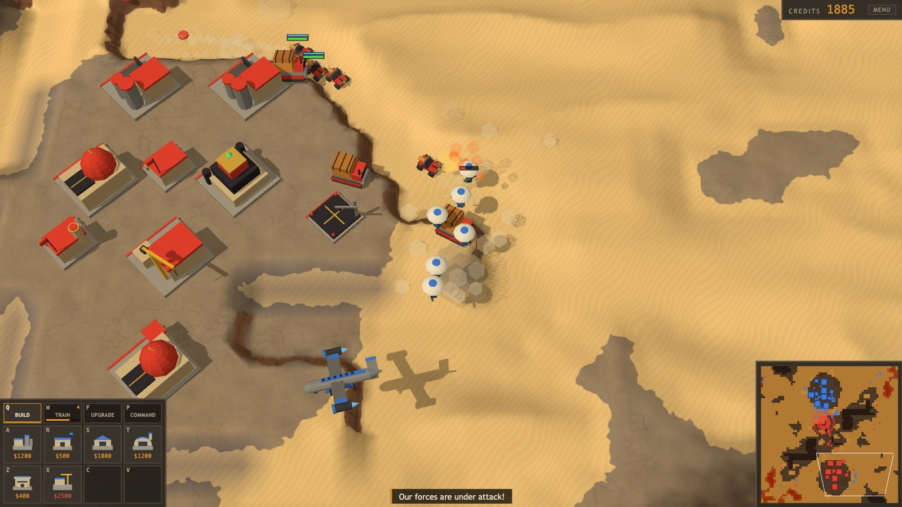
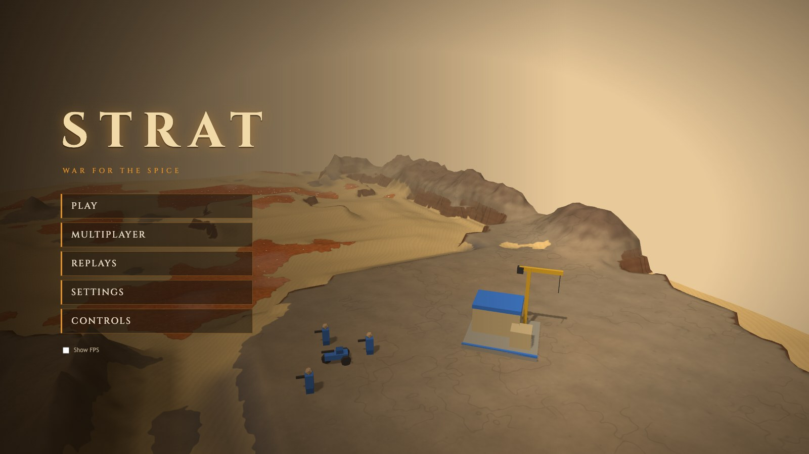
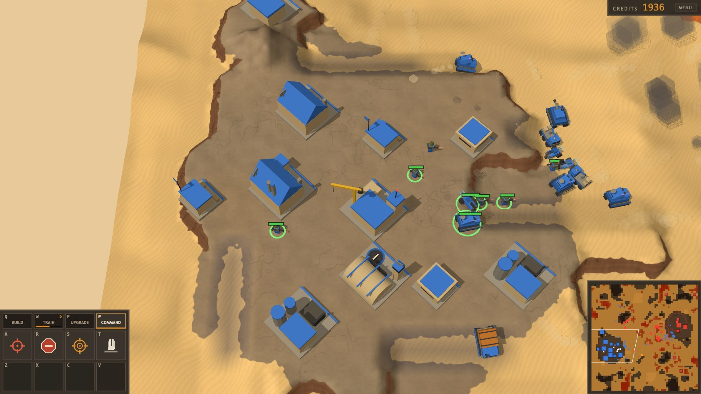
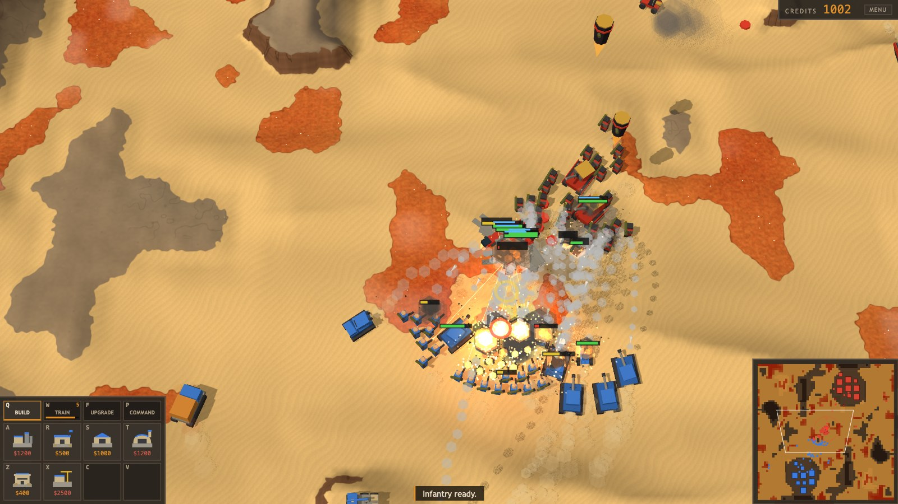
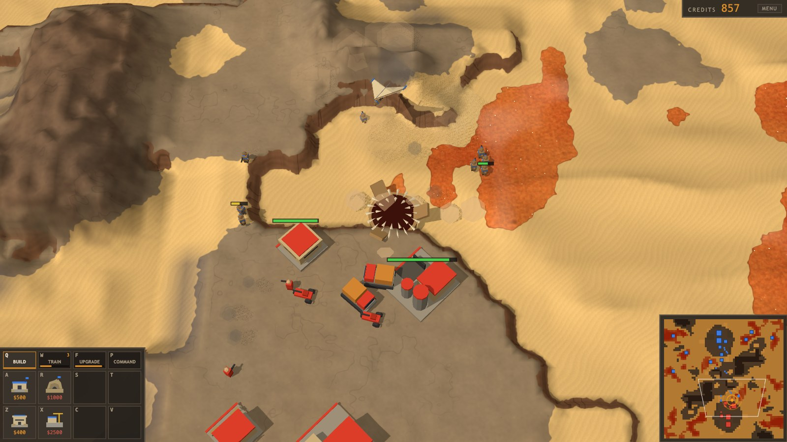
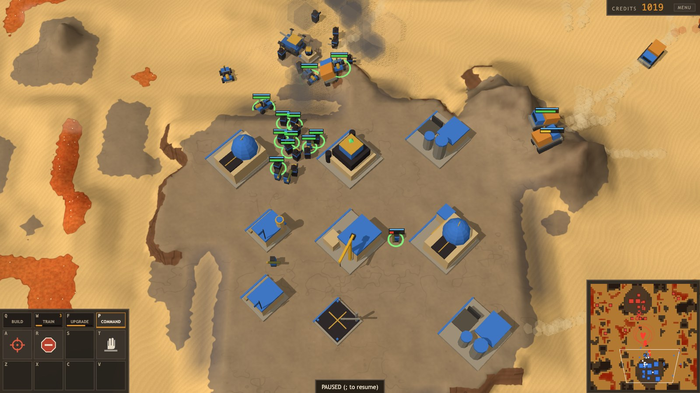
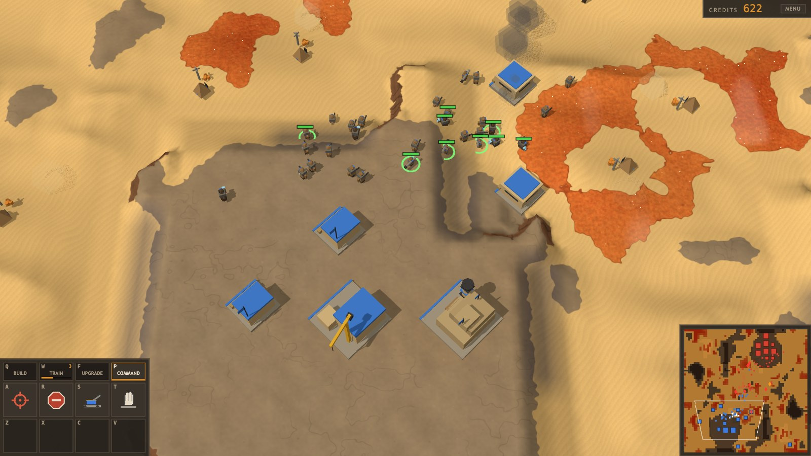
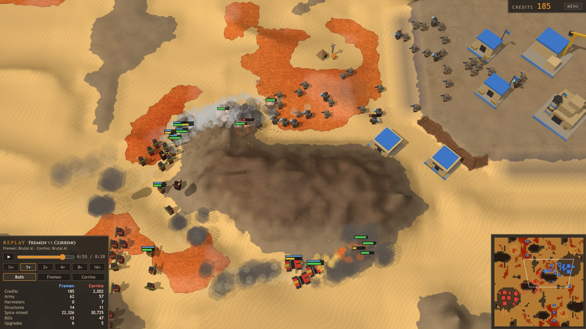

# Strat

A Dune-style real-time strategy game in the browser, built with Three.js and TypeScript. Harvest spice, build a base, and fight a computer opponent (or a friend, online) across a randomly generated desert as one of three factions: the mobile Atreides, the shielded Corrino, or the Fremen, who hide in the sand and call down Sandworms.



## Features

- **Three factions that play differently.**
  - **Atreides:** fast and mobile. Trikes, tanks, MLRS, Repair Vehicles, and Carryalls that airlift and paradrop units.
  - **Corrino:** slow and shielded. Units and structures carry shields that recharge out of combat, structures repair themselves, and units heal at a Repair Pad. Sardaukar, flame-throwing Razors, Devastators that can self-destruct, Soulcrushers that dig in to shell from range, mine-laying Sky Raiders, and infantry that land by drop pod.
  - **Fremen:** swift and hidden. No harvesters: Spice Crews set up camps right on the spice fields. Units dig into the sand when they stand still, out of the enemy's sight, heal on their own, and move faster on sand. Warriors, Fedaykin with weirding modules, rocket Mortars that set up to fire, and Wind Gliders for scouting. Structures can go on open sand.
- **Sandworms.** Fremen Warriors and Fedaykin plant Thumpers. A few seconds later a wild Sandworm surfaces and swallows whatever moves on the sand around it, whoever it belongs to, and harvesters even standing still. Enemies nearby hear the drumming and can destroy the Thumper in time.
- **Classic Dune economy.** Atreides and Corrino Harvesters collect spice and bring it to Refineries for credits, backing in against whichever side of the refinery is closest, and drive straight through your own army on the way. Spice fields shimmer and run out as they're harvested.
- **StarCraft-style base handling.** Buildings sit at a 45-degree angle (only for the look: they still take up square tiles). Each production building has its own rally point, shown with a line and a flag while it's selected, and new units come out of the side facing it.
- **Procedural maps.** Every game gets a new, point-symmetric map in one of three sizes. The desert has dunes, scattered mesas and rock shelves with cliffs on one edge. Spawns are random, and the end screen shows the seed so you can replay a map with `?seed=N`.
- **Elevation that matters.** Units only climb to high ground by ramps, and they shoot further downhill than up. A base on a rock shelf has a cliff flank that only long-range artillery can hit from below, once something spots for them.
- **Fog of war.** You only see what your units and buildings see. Low ground can't see up onto high ground, and high ground blocks the view past it, so mesas hide what's behind them. A Carryall overhead sees everything around it. Anything that shoots at you is revealed for a moment. Enemy structures stay on screen as last seen. Add `?reveal` to the address to lift the fog in single player.
- **Bunkers.** Fill one with three infantry: they shoot out from cover, Infantry Rockets included, and can't be hit inside. Tanks and MLRS outrange them.
- **Counter-based combat.** Units have StarCraft-style tags (light, armored, biological, mechanical) with bonus damage against them. Tanks and MLRS can fire on the move, and vehicles tilt with the ground and leave dust trails across the sand.
- **Tech and upgrades.** Each faction has its own: building level-ups, Weapons and Armor, and faction upgrades such as Infantry Rockets and Trike Nitro (Atreides), Shields and Flame Range (Corrino), or Stillsuits, Sandwalk and Ambush (Fremen). Weapons and Armor upgrades show on the unit models.
- **Carryalls and airborne drops.** The Hi-Tech Factory builds Carryalls. Each can lift a heavy vehicle, two trikes or six infantry and drop them anywhere:
  - Heavy vehicles are set down in a touch-and-go landing.
  - Infantry and trikes parachute out on a fly-by.
  - A Carryall assigned to a harvester ferries it between field and refinery, and flies it home if it comes under attack.
- **Anti-air.** Infantry and MLRS can shoot aircraft down. Troopers aboard a downed Carryall bail out by parachute.
- **Repair.** Atreides Repair Vehicles fix vehicles, aircraft and buildings for credits, and infantry heal on their own once out of combat. Corrino use a Repair Pad and mend their structures; Fremen heal on their own.
- **Sound and music.** An announcer, unit acknowledgements, weapon and explosion sounds heard where you can see them, and music on the title screen and in matches. Separate volume sliders for effects, units, announcer and music, in Settings and in the in-game menu.
- **Alerts and quality of life.** Located alerts ping the minimap ("Harvester under attack!", "Thumper detected!"), and Space jumps to the latest one. Shift queues orders, Rally All points every production building at once, the IDLE button finds idle harvesters and Spice Crews, and the credits readout estimates your income.
- **Replays.** Every game is kept to watch again (title screen, Replays), and the end screen saves it as a small file to share. Watch at up to 16× speed, jump to any moment, and see the battle through either side's fog of war with both sides' numbers alongside. Two Brutal-vs-Brutal games, Fremen beating Corrino, come with the game.
- **Online 1v1.** Host a game on your own server (a Raspberry Pi is plenty) and play a friend on your network. See [Multiplayer](#multiplayer).
- **A computer opponent** that plays any of the three factions (pick one, or Random) under the same fog of war as you, with no map knowledge: it scouts to find your base and see what you're building, and plans only from what it has seen. It defends in proportion to the attack, rebuilds its economy after losses, and offers to surrender when it's beaten (you can refuse and keep playing). On Hard it runs a bigger economy, attacks when it's stronger, raids your harvesters, repairs its vehicles after defending and pulls back from fights it's losing. It uses its faction's tricks: Corrino deploys Soulcrushers and drops pods, Fremen hide, set up camps and call Sandworms. On Brutal its units kite and focus fire, pull badly hurt units out of fights, and march in formation; it splits its attacks, raids more, and late in the game Atreides drop MLRS and paratroopers on your harvesters by Carryall, lifting them out again before you can catch them. End-of-game stats screen.

## Screenshots

| | |
|---|---|
|  |  |
| The main menu, over a fly-over of the generated map. | An Atreides base, with the command card bottom left and the minimap bottom right. |
|  |  |
| Atreides and Corrino clash over a spice field. | A Fremen Thumper's Sandworm bursts up beside an enemy refinery. |
|  |  |
| A Corrino base, with its Repair Pad and army. | A Fremen base, with a group of Warriors selected. |
|  | |
| Watching a replay: speed, timeline, whose eyes to watch through, and both sides' numbers. | |

## Getting started

You need [Node.js](https://nodejs.org/) 20.19 or newer (or 22.12+).

```sh
npm install
npm run dev
```

Then open the address Vite prints (usually http://localhost:5173). `npm run build` makes a production build in `dist/`.

## Multiplayer

Online games are 1v1 between two browsers, through a small game server you run yourself. The server only pairs players and passes their commands along. Each browser runs the whole game, in lockstep (see [docs/MULTIPLAYER.md](docs/MULTIPLAYER.md)), so the server needs almost no CPU. The simulation does its own trigonometry rather than use the browser's, so it plays out bit for bit the same in Chrome, Firefox and Safari.

On the machine that will host (your PC, or a Raspberry Pi):

```sh
npm install
npm run build
npm run serve
```

It prints addresses like `http://192.168.1.20:8080`. Both players open that address, pick **Multiplayer**, enter a name and choose a faction. One clicks **Host game**, and the other clicks the game under **Open games**.

- `PORT=9000 npm run serve` uses another port.
- During development, run `npm run serve` and `npm run dev` side by side. The dev page reaches the server through Vite.
- Both players need the same build. After you update, rebuild and restart the server, and both players reload the page.

**Raspberry Pi.** Install Node.js 22, for example from [NodeSource](https://github.com/nodesource/distributions); Raspberry Pi OS's own package is too old to build. Then run the commands above in a clone of this repository. To keep the server running after you log out, run it as a systemd service or under `tmux`. If the Pi is slow to build, run `npm run build` on your PC and copy `dist/` over. The server serves whatever is in `dist/`.

## Controls

| Input | Action |
|---|---|
| Left click / drag | Select units, or box-select |
| Double click | Select every unit (or building) of that type on screen |
| **Tab** | In a mixed selection, hand the Command tab to the next unit type (the highest tier leads) |
| Right click | Move, attack, harvest, set a rally point, repair, pick up (Carryall), garrison a Bunker |
| **Shift** + right click / ability | Queue it after the units' current orders (e.g. walk to a spice field, then Set Up Camp) |
| **Q W E R** | Command card tabs: Build, Train, Upgrade, Command |
| **A S D F**, **Z X C V** | The buttons on the open tab |
| **A**, then click (Command tab) | Attack-move (on a production building: set its rally point) |
| **S** (Command tab) | Stop |
| **D** (Command tab) | The unit's ability: Carryall drop, Deploy / Pack Up, Lock On (MLRS), Lay Mine (Sky Raider), Set Up Camp (Spice Crew), Plant Thumper |
| **F** (Command tab) | Hold Position (Bunker: Unload) |
| **V** (Command tab) | Self-destruct (Devastator); salvage a Bunker |
| **V** (Train tab) | Rally All: set every production building's rally point, keeping your selection |
| IDLE button (top right) | Select the next idle harvester or Spice Crew (Shift: all of them) |
| Minimap | Left click to look there; right click to send the selection there; attack-move, drop and rally clicks work on it too |
| **Ctrl+1-9** / **1-9** | Set / select a control group (double-tap to jump to it) |
| **Space** | Jump to the latest alert (else to your base) |
| **`** (left of 1) | Select the whole army (twice: jump to it) |
| **~** (Shift + `) | Select all idle harvesters and Spice Crews |
| **P** | Pause (not in online games; in a replay, pauses playback) |
| Arrow keys, screen edges, middle-drag | Pan the camera |
| **Esc** | Cancel, or open the menu |

Hotkeys all sit under the left hand, as in Stormgate. The command card in the bottom left is a 4×3 grid: the top row picks a tab, and the two rows below hold that tab's buttons, always in the same places. Keys go by position, so on Colemak the same grid is Q W F P, A R S T and Z X C V (Chrome and Edge print your layout's letters on the buttons). Selecting units opens the Command tab, so A is always attack-move with an army selected; deselecting them goes back to the tab you were on.

Click a button or press its key to build, train or research, and right-click it to cancel. A finished structure waits on its button until you press it again and place the building on rock near your base. The tabs show progress too: a bar under Build, Train and Upgrade while something is underway, and Build pulses when a structure is ready to place.

## Units and buildings

Every faction starts with a Construction Yard (which builds its structures, one at a time) and a few units. The in-game tooltips have the full details.

### Atreides

| Building | Notes |
|---|---|
| Refinery | Turns spice into credits. Comes with a free Harvester. |
| Barracks | Trains infantry. |
| Bunker | Holds three infantry, who shoot from it and can't be hurt while inside. |
| Factory | Builds vehicles. Level 2 unlocks the MLRS and tier-2 Weapons and Armor. |
| Hi-Tech Factory | Builds Carryalls. |

| Unit | Role |
|---|---|
| Harvester | Collects spice. |
| Infantry | Cheap and strong against infantry. Devastating against armor with Infantry Rockets. Can hit aircraft. |
| Trike | Fast raider for harassing harvesters. Faster still with Nitro. |
| Tank | Main battle tank. Fires on the move. |
| MLRS | Long-range rocket artillery and anti-air. Lock On makes its rockets home in. Can't fire up close. |
| Repair Vehicle | Repairs vehicles, aircraft and buildings. |
| Carryall | Airlifts and drops units, and ferries harvesters. |

### Corrino

Units and structures have shields that recharge out of combat. Structures can repair themselves (Mend); units heal only at a Repair Pad.

| Building | Notes |
|---|---|
| Refinery, Barracks | As Atreides. The Imperial Barracks (level 2) unlocks Sardaukar and drop pods: new infantry land by pod at the rally point. |
| Fab | Builds vehicles, aircraft and Harvesters. Level 2 unlocks the Devastator. |
| Tleilaxu Research | Unlocks Sky Raiders, Soulcrushers, Devastators and Shields upgrades. |
| Repair Pad | Restores units parked next to it, two at a time. |
| Auto Turret | Small automatic gun emplacement. |

| Unit | Role |
|---|---|
| Harkonnen Trooper | Shoulder rockets: strong against vehicles. |
| Sardaukar | Elite close-quarters infantry. Tear through infantry and shoot down aircraft. |
| Razor | Flame-throwing dune buggy that burns everything in front of it. |
| Devastator | Slow heavy tank with a machine gun for infantry. Can self-destruct in a huge blast. |
| Sky Raider | Ornithopter for scouting and raids. Lays mines. |
| Soulcrusher | Deploys to shell anything your side can see at long range. Brutal on buildings. |

### Fremen

No harvesters or refineries: Spice Crews set up Spice Camps on the fields. Units hide when they stand still on sand, heal on their own, and move faster on sand. Structures can go on sand or rock.

| Building | Notes |
|---|---|
| Barracks | Trains every Fremen unit. |
| Sietch | Unlocks Fedaykin, Wind Gliders, Thumpers and research. The Great Sietch (level 2) unlocks Mortars and Ambush. |
| Bunker | As Atreides. |
| Spice Camp | Set up by a Spice Crew on a spice field. Turns the spice around it into credits, and packs up again when the field runs dry. |
| Thumper | Planted by a Warrior or Fedaykin. Calls a wild Sandworm, which eats anything moving on the sand nearby, yours included. |

| Unit | Role |
|---|---|
| Fremen Warrior | Cheap, fast fighter. Strong against infantry, can hit aircraft. |
| Fedaykin | Elite fighters whose weirding modules tear through vehicles and pass straight through shields. |
| Fremen Mortar | Sets up to lob guided rockets at anything your side can see. Strong against vehicles and structures. |
| Spice Crew | Unarmed. Sets up Spice Camps. |
| Wind Glider | The fastest thing in the sky. An unarmed scout that circles wherever it's sent. |

## Development

- `npm run typecheck`: type-check the game and the server.
- `sim/`: headless simulations and checks that run the real game code without a browser. For example:
  - `npx tsx sim/air-repair-check.ts`: Carryall, paradrop and repair behavior.
  - `npx tsx sim/ai-check.ts`: AI defense, economy recovery and surrender (`DIFFICULTY=hard` or `brutal`).
  - `sim/brutal.sh 80 hard brutal no-air`: Brutal and variants of it (`sim/brutal-match.ts`) against Hard; `SEEDS=2000` for a fresh set of maps. `npx tsx sim/micro-check.ts`: equal-cost battles with Brutal's micro on one side.
  - `MAPS=random sim/run.sh 10 4 hard`: a profile from `sim/variants.ts` against Normal, 40 games on random maps.
  - `sim/gauntlet.sh 20 hard brutal`: Hard and Brutal against scripted player strategies (rush, turtle, harass, rockets, drop).
  - `npx tsx sim/side-bias.ts`: spawn fairness, the same AI on both sides of each map.
  - `npx tsx sim/matchups.ts`: re-measure unit matchups for the AI after changing unit stats; `npx tsx sim/duel.ts` for quick duels.
  - `npx tsx sim/terrain-check.ts 3`: AI matches, checked for illegal moves and stuck units.
  - `CHECK=60 QUIET=1 npx tsx sim/maps.ts`: generate 60 maps and validate them.
  - `npx tsx sim/ai-fog-check.ts`: the AI knows only what it has seen, and scouts.
  - `npx tsx sim/vision-check.ts`: fog of war rules (cliffs, mesas, aircraft, attackers revealed).
  - `FACTIONS=fremen,corrino sim/faction-match.sh 32 brutal brutal`: AI-vs-AI games between two factions, with what each side built and which abilities it used.
  - `npx tsx sim/determinism.ts`: the simulation is deterministic (same seed and commands, same game), which online play depends on.
  - `npx tsx sim/netplay-check.ts`: an online match between two headless players through the real server, checked for desyncs, and replayed from its command log.
  - `SAVE=replays npx tsx sim/replay-match.ts fremen,corrino brutal,brutal 8`: AI-vs-AI games saved as replay files (watch them from the title screen's Replays page, or with `npx tsx sim/replay-trace.ts <file>` minute by minute); `npx tsx sim/replay-check.ts <file>` checks a replay still plays back as recorded.
- [docs/CODE_LAYOUT.md](docs/CODE_LAYOUT.md): where everything lives in `src/`.
- [docs/PLAN.md](docs/PLAN.md): the roadmap and design decisions.

## Credits

Music by [Eitan Epstein Music](https://www.youtube.com/channel/UCsqtmlVpv6jxZzUo3n89J_w).

## License

[MIT](LICENSE) for the code. The music belongs to its composer (see [Credits](#credits)) and isn't covered by this license.
