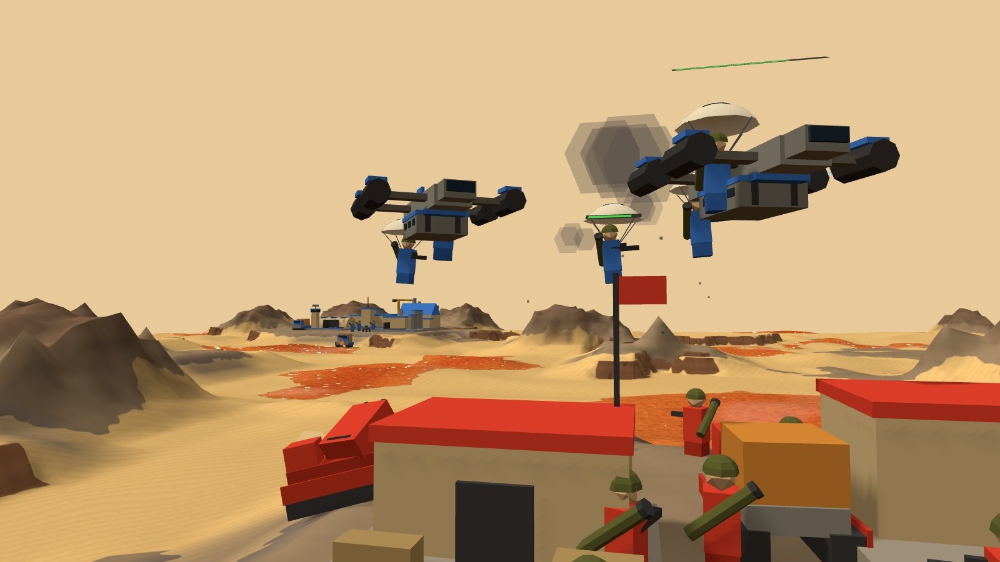
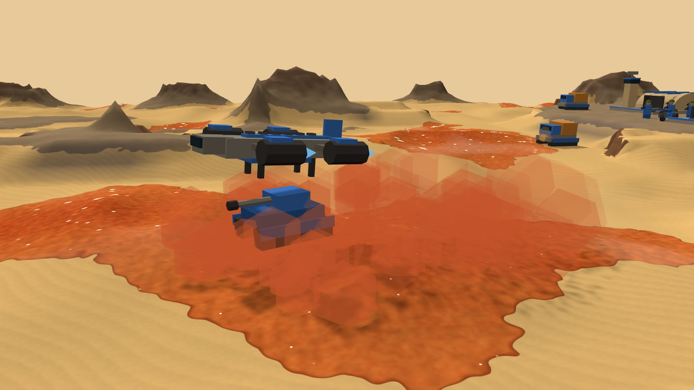

# Strat

A Dune-style real-time strategy game in the browser, built with Three.js and TypeScript. Harvest spice, build a base, and fight a computer opponent across a randomly generated desert. You can also drop paratroopers on top of its base.



## Features

- **Classic Dune economy.** Harvesters collect spice and bring it to Refineries for credits. Spice fields shimmer and run out as they're harvested.
- **Procedural maps.** Every game gets a new, point-symmetric map in one of three sizes. The desert has dunes, scattered mesas and rock shelves with cliffs on one edge. Spawns are random, and the end screen shows the seed so you can replay a map with `?seed=N`.
- **Elevation that matters.** Units only climb to high ground by ramps, and they shoot further downhill than up. A base on a rock shelf has a cliff flank that only rocket launchers can hit from below.
- **Counter-based combat.** Units have StarCraft-style tags (light, armored, biological, mechanical) with bonus damage against them. Tanks and rocket launchers can fire on the move, and vehicles tilt with the ground.
- **Tech and upgrades.** Level-2 Construction Yard and Factory, two tiers each of Weapons and Armor, Infantry Rockets, Trike Nitro and Harvesting. Each upgrade shows on the unit models.
- **Carryalls and airborne drops.** The Hi-Tech Factory builds Carryalls. Each can lift a heavy vehicle, two trikes or six infantry and drop them anywhere:
  - Heavy vehicles are set down in a touch-and-go landing.
  - Infantry and trikes parachute out on a fly-by.
  - A Carryall assigned to a harvester ferries it between field and refinery, and flies it home if it comes under attack.
- **Anti-air.** Infantry and rocket launchers can shoot Carryalls down. Troopers aboard a downed Carryall bail out by parachute.
- **Repair.** Repair Vehicles fix vehicles, aircraft and buildings for credits. Infantry heal on their own once out of combat.
- **A computer opponent** on Normal, Hard or Brutal, with an end-of-game stats screen.

## Screenshots

| | |
|---|---|
|  |  |
| A paradrop on the enemy base: trikes and infantry come down under canopies while the defenders shoot back. | A touch-and-go drop: the Carryall comes in low, sets the tank down and climbs away. Its downwash raises red dust over spice. |
|  |  |
| Armies clash in the open desert. | A built-up base, with a Carryall ferrying the harvester. |

## Getting started

You need [Node.js](https://nodejs.org/) 20.19 or newer (or 22.12+).

```sh
npm install
npm run dev
```

Then open the address Vite prints (usually http://localhost:5173). `npm run build` makes a production build in `dist/`.

## Controls

| Input | Action |
|---|---|
| Left click / drag | Select units, or box-select |
| Double click | Select every unit of that type on screen |
| Right click | Move, attack, harvest, set a rally point, repair (Repair Vehicle), pick up (Carryall) |
| **F**, then click | Attack-move |
| **E**, then click | Carryall drop |
| **X** | Stop |
| **Ctrl+1-9** / **1-9** | Set / select a control group (double-tap to jump to it) |
| **H** | Jump to your base |
| **WASD**, arrow keys, screen edges, middle-drag | Pan the camera |
| **P** | Pause |
| **Esc** | Cancel, or open the menu |

Production is in the sidebar on the right. Click a card to build or train, and right-click it to cancel. A finished structure waits on its card until you click the card again and place the building on rock near your base.

## Units and buildings

| Building | Notes |
|---|---|
| Construction Yard | Builds structures. Upgrades to HQ Level 2. |
| Refinery | Turns spice into credits. Comes with a free Harvester. |
| Barracks | Trains infantry. |
| Factory | Builds vehicles. Upgrades to Level 2 for Rocket Launchers and tier-2 upgrades. |
| Hi-Tech Factory | Builds Carryalls. |

| Unit | Role |
|---|---|
| Harvester | Collects spice. |
| Infantry | Cheap and strong against infantry. Devastating against armor with the Rockets upgrade. Can hit aircraft. |
| Trike | Fast raider for harassing harvesters. |
| Tank | Main battle tank. Fires on the move. |
| Rocket Launcher | Long-range artillery and anti-air. Can't fire up close. |
| Repair Vehicle | Repairs vehicles, aircraft and buildings. |
| Carryall | Airlifts and drops units, and ferries harvesters. |

## Development

- `npm run typecheck`: type-check the project.
- `sim/`: headless simulations and checks that run the real game code without a browser. For example:
  - `npx tsx sim/air-repair-check.ts`: Carryall, paradrop and repair behavior.
  - `npx tsx sim/terrain-check.ts 3`: AI matches, checked for illegal moves and stuck units.
  - `CHECK=60 QUIET=1 npx tsx sim/maps.ts`: generate 60 maps and validate them.
- [docs/CODE_LAYOUT.md](docs/CODE_LAYOUT.md): where everything lives in `src/`.
- [docs/PLAN.md](docs/PLAN.md): the roadmap and design decisions.
